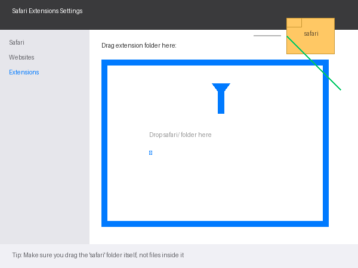

# Installation Guide

## Chrome / Edge Installation

### Step 1: Download
Download `clipquotes-chrome.zip` from the [Releases page](https://github.com/eason-joker/clipquotes/releases).

### Step 2: Extract
Double-click the ZIP to extract. You should see a `chrome/` folder.

### Step 3: Open Extensions Page
Paste this in your browser address bar:
```
chrome://extensions/
```

### Step 4: Enable Developer Mode
Toggle **"Developer mode"** ON (top right).

### Step 5: Load Extension
1. Click **"Load unpacked"** (top left)
2. Select the `chrome/` folder
3. Click "Select Folder"

### Step 6: Done! ✅
Click the ClipQuotes icon in your toolbar.

---

## Safari Installation (3 Steps)

### Step 1: Download & Extract
Download `clipquotes-safari.zip` from the [Releases page](https://github.com/eason-joker/clipquotes/releases). Double-click to extract. You should see a `safari/` folder.

### Step 2: Open Safari Extensions Settings
1. Open **Safari**
2. Click **Safari** menu → **Settings** (or press `⌘,`)
3. Click the **"Extensions"** tab

### Step 3: Install
**Drag the `safari/` folder and drop it anywhere onto the Safari Extensions settings window, then release.**

See illustration below:



That's it! The extension will be installed automatically.

---

## FAQ

**Q: Dragged but nothing happened?**
A: Make sure you're dragging the `safari/` folder itself, not files inside it.

**Q: Where is the Safari Extensions settings?**
A: Safari → Safari menu → Settings → Extensions

**Q: Icon not showing after install?**
A: Right-click Safari toolbar → "Customize Control Strip" → Drag ClipQuotes to toolbar

**Need help?**
→ Open an [Issue](https://github.com/eason-joker/clipquotes/issues)
