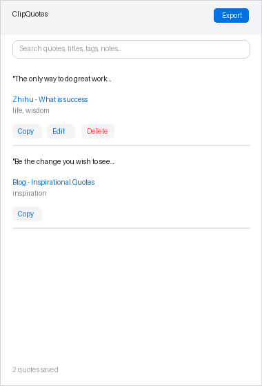
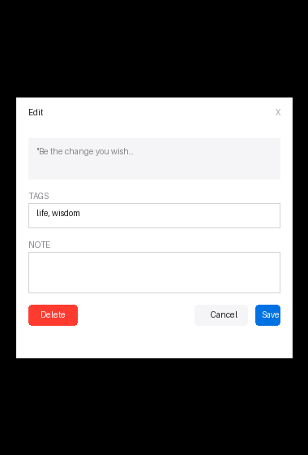

# ClipQuotes

A browser extension that lets you select text on any page and save it with a right-click. Perfect for collecting inspiring quotes, passages, and insights.

[](https://github.com/eason-joker/clipquotes/stargazers)
[](https://opensource.org/licenses/MIT)

## Features

| Feature | Description |
|---------|-------------|
| **Right-click to save** | Select text → Right-click → "Save Quote" |
| **Source tracking** | Automatically saves: page title, URL, timestamp |
| **Tags** | Add multiple tags to organize your collection |
| **Notes** | Add your thoughts or comments |
| **Search** | Full-text search across quotes, titles, tags, and notes |
| **Edit/Delete** | Edit tags, notes, or delete items |
| **Copy text** | One-click copy to clipboard |
| **Markdown export** | Export all quotes as a Markdown file |
| **Local storage** | Data stays on your device — no cloud, no login |

## Screenshots

### Main Popup


### Edit Modal


## Supported Browsers

| Browser | Requirements | Installation |
|---------|--------------|--------------|
| Chrome / Edge | Manifest V3 | [Download ZIP](#download) → Developer mode |
| Safari | macOS Safari 16+ | [Download ZIP](#download) → Developer mode |

## Download

### Chrome / Edge
**[Download ClipQuotes for Chrome](releases/clipquotes-chrome.zip)**

### Safari
**[Download ClipQuotes for Safari](releases/clipquotes-safari.zip)**

## Installation

### Chrome / Edge

1. Download the [Chrome ZIP](releases/clipquotes-chrome.zip)
2. Open `chrome://extensions/`
3. Enable **"Developer mode"** (top right)
4. Click **"Load unpacked"**
5. Select the unzipped `chrome/` folder

### Safari

1. Download the [Safari ZIP](releases/clipquotes-safari.zip)
2. Open Safari → **Preferences** → **Extensions**
3. Enable **"Allow extensions to download files"** (for export feature)
4. Select **"ClipQuotes"** and enable
5. For debugging: Safari menu → Develop → Show Extension Builder

## Project Structure

```
ClipQuotes/
├── README.md            # This file
├── LICENSE              # MIT License
├── CONTRIBUTING.md      # Contribution guidelines
├── chrome/              # Chrome/Edge version
│   ├── manifest.json
│   ├── background.js
│   ├── content.js
│   ├── popup/
│   │   ├── popup.html
│   │   ├── popup.css
│   │   └── popup.js
│   └── icons/
├── safari/             # Safari version
│   ├── manifest.json
│   ├── background.js
│   ├── content.js
│   ├── popup/
│   └── icons/
├── releases/           # Pre-built ZIP packages
│   ├── clipquotes-chrome.zip
│   └── clipquotes-safari.zip
├── screenshots/       # UI screenshots
└── .github/          # GitHub config
    ├── workflows/
    └── ISSUE_TEMPLATE/
```

## Permissions

| Permission | Purpose |
|------------|---------|
| `contextMenus` | Create right-click menu "Save Quote" |
| `activeTab` | Get current page info (title, URL) |
| `storage` | Save quotes to browser local storage |

**Privacy:** This extension does not collect, transmit, or share any user data.

## Markdown Export Example

```markdown
# ClipQuotes

> 3 items  |  Exported: 1/15/2024, 2:30 PM

## 1. What is happiness

**Quote:**
> The most precious thing in life is time. Each person has only one life...

**Source:** [Article - What is happiness](https://example.com/article)
**Saved:** 1/15/2024, 2:25 PM
**Tags:** life, wisdom
**Note:** Classic quote

---
```

## Contributing

Contributions are welcome! Please see [CONTRIBUTING.md](CONTRIBUTING.md) for guidelines.

## License

MIT License - see [LICENSE](LICENSE)
